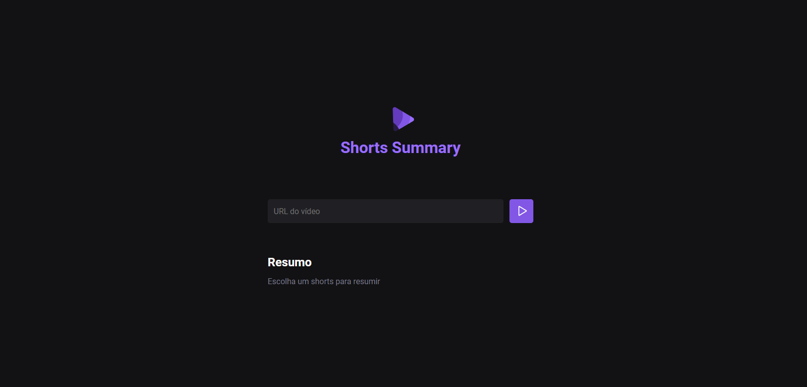

# Next Level Week - IA 2023 / Rocketseat

Evento realizado pela Rocketseat através de aulas e lives, com o objetivo de mostrar como a IA pode ser usada no desenvolvimento.

Este projeto tem como objetivo usar a inteligência artificial para realizar o resumo de vídeos(Shorts) do youtube apenas usando a URL.



## Tecnologias usadas:
- HTML
- CSS
- Node.js
- Integração IA: **OpenAI**

## Utilização:

Para visualizar o projeto é necessário clonar o repositório e instalar as dependências.
```
npm install
```
**Rodar o server e a web**
```
npm run server

npm run web
```

